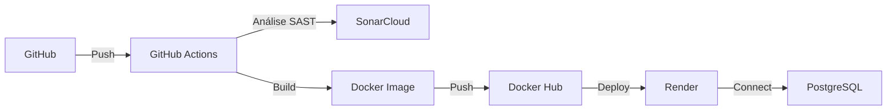

# 🚀 Festmedeiros API SAST

[](https://github.com/konsanii/festmedeiros-api-sast/actions/workflows/ci-cd.yml)
[](https://sonarcloud.io/summary/new_code?id=konsanii_festmedeiros-api-sast)
[](https://sonarcloud.io/summary/new_code?id=konsanii_festmedeiros-api-sast)
[](https://sonarcloud.io/summary/new_code?id=konsanii_festmedeiros-api-sast)

> API REST desenvolvida com práticas de DevSecOps, incluindo análise de segurança SAST, CI/CD automatizado e deploy em nuvem.

---

## 📋 Sobre o Projeto

Esta é uma API REST desenvolvida como parte de uma atividade acadêmica sobre **DevSecOps**. O projeto implementa um pipeline completo de CI/CD com foco em segurança, utilizando ferramentas modernas e boas práticas de desenvolvimento.

### 🎯 Objetivos

- ✅ Implementar uma API funcional com documentação Swagger
- ✅ Configurar análise de segurança (SAST) com SonarCloud
- ✅ Criar pipeline CI/CD automatizado com GitHub Actions
- ✅ Deploy automático no Docker Hub
- ✅ Hospedar aplicação na nuvem (Render)
- ✅ Utilizar banco de dados PostgreSQL online
- ✅ Seguir GitFlow para versionamento

---

## 🛠️ Tecnologias Utilizadas

### Backend
- **Node.js** (v18+)
- **Express** - Framework web
- **PostgreSQL** - Banco de dados relacional
- **MySQL2** - Driver para PostgreSQL
- **Swagger UI Express** - Documentação da API
- **dotenv** - Gerenciamento de variáveis de ambiente

### DevOps & Cloud
- **Docker** - Containerização
- **Docker Hub** - Registry de imagens
- **GitHub Actions** - CI/CD
- **SonarCloud** - Análise de código e segurança (SAST)
- **Render** - Hospedagem da aplicação
- **PostgreSQL (Render)** - Banco de dados em nuvem

---

## 🚀 Demonstração

### 🌐 Links Importantes

- **API em Produção**: https://festmedeiros-api-sast-0-1-0.onrender.com
- **Documentação Swagger**: https://festmedeiros-api-sast-0-1-0.onrender.com/swagger
- **Docker Hub**: https://hub.docker.com/r/lucasconsani/festmedeiros-api-sast
- **SonarCloud Dashboard**: https://sonarcloud.io/project/overview?id=konsanii_festmedeiros-api-sast

### 📍 Endpoints Disponíveis

```
GET  /              - Mensagem de boas-vindas
GET  /users         - Lista todos os usuários
GET  /swagger       - Documentação interativa da API
```

---

## 🏗️ Arquitetura



---

## 📦 Instalação e Uso Local

### Pré-requisitos

- Node.js 18+
- Docker (opcional)
- Git

### 1. Clone o repositório

```bash
git clone https://github.com/konsanii/festmedeiros-api-sast.git
cd festmedeiros-api-sast
```

### 2. Instale as dependências

```bash
npm install
```

### 3. Configure as variáveis de ambiente

Crie um arquivo `.env` na raiz do projeto:

```env
PORT=3000
DB_HOST=seu_host_postgres
DB_USER=seu_usuario
DB_PASS=sua_senha
DB_NAME=seu_banco
```

### 4. Execute a aplicação

```bash
npm start
```

A API estará disponível em: `http://localhost:3000`

---

## 🐳 Docker

### Build da imagem

```bash
docker build -t festmedeiros-api-sast .
```

### Executar container

```bash
docker run -p 3000:3000 --env-file .env festmedeiros-api-sast
```

### Usar imagem do Docker Hub

```bash
docker pull lucasconsani/festmedeiros-api-sast:latest
docker run -p 3000:3000 lucasconsani/festmedeiros-api-sast:latest
```

---

## 🔄 Pipeline CI/CD

O projeto utiliza **GitHub Actions** para automação completa do ciclo de desenvolvimento.

### Fluxo do Pipeline

1. **Trigger**: Push ou Pull Request para branches `main`, `master` ou `feat/**`
2. **SonarCloud Analysis**: Análise de código e segurança
3. **Docker Build**: Criação da imagem Docker
4. **Docker Push**: Envio para Docker Hub
5. **Deploy**: Atualização automática no Render

### Configuração de Secrets

Os seguintes secrets devem ser configurados no GitHub:

- `SONAR_TOKEN` - Token do SonarCloud
- `DOCKERHUB_TOKEN` - Token do Docker Hub

---

## 🔒 Segurança (SAST)

O projeto utiliza **SonarCloud** para análise estática de segurança (SAST):

- ✅ Detecção de vulnerabilidades
- ✅ Code smells
- ✅ Bugs potenciais
- ✅ Análise de qualidade do código
- ✅ Coverage reports

### Resultados da Análise

[](https://sonarcloud.io/summary/new_code?id=konsanii_festmedeiros-api-sast)
[](https://sonarcloud.io/summary/new_code?id=konsanii_festmedeiros-api-sast)
[](https://sonarcloud.io/summary/new_code?id=konsanii_festmedeiros-api-sast)
[](https://sonarcloud.io/summary/new_code?id=konsanii_festmedeiros-api-sast)

---

## 📂 Estrutura do Projeto

```
festmedeiros-api-sast/
├── .github/
│   └── workflows/
│       └── ci-cd.yml          # Pipeline GitHub Actions
├── node_modules/
├── .env                        # Variáveis de ambiente (não versionado)
├── .gitignore                  # Arquivos ignorados pelo Git
├── database.js                 # Configuração do banco de dados
├── Dockerfile                  # Configuração Docker
├── index.js                    # Ponto de entrada da aplicação
├── package.json                # Dependências do projeto
├── package-lock.json           # Lock de dependências
├── README.md                   # Este arquivo
├── sonar-project.properties    # Configuração SonarCloud
└── swagger.json                # Documentação OpenAPI/Swagger
```

---

## 🌳 GitFlow

O projeto segue o modelo GitFlow:

- `main` - Código em produção
- `develop` - Branch de desenvolvimento
- `feat/*` - Features em desenvolvimento
- `fix/*` - Correções de bugs
- `hotfix/*` - Correções urgentes em produção

### Fluxo de Trabalho

```bash
# Criar nova feature
git checkout -b feat/nome-da-feature develop

# Fazer commits
git add .
git commit -m "feat: descrição da feature"

# Merge para develop
git checkout develop
git merge feat/nome-da-feature

# Merge para main (release)
git checkout main
git merge develop
```

---

## 📊 Status do Projeto

- ✅ API funcionando em produção
- ✅ Pipeline CI/CD automatizado
- ✅ Análise SAST integrada
- ✅ Docker Hub atualizado automaticamente
- ✅ Deploy automático no Render
- ✅ Documentação Swagger disponível
- ✅ Banco de dados PostgreSQL online

---

## 👨‍💻 Autor

**Lucas Consani**

- GitHub: [@konsanii](https://github.com/konsanii)
- Docker Hub: [lucasconsani](https://hub.docker.com/u/lucasconsani)

---

## 📄 Licença

Este projeto foi desenvolvido para fins acadêmicos como parte de uma atividade sobre DevSecOps.

---

## 🙏 Agradecimentos

- Professor pela orientação na atividade
- SonarCloud pela plataforma de análise gratuita
- Render e Docker Hub pelos serviços gratuitos

---

<div align="center">

**Desenvolvido com ❤️ e DevSecOps**

[](https://github.com/konsanii)
[](https://hub.docker.com/u/lucasconsani)

</div>
